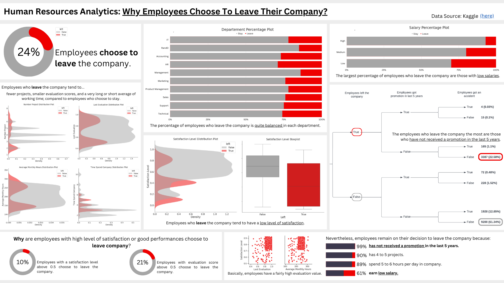

# Human Resources Analytics: **Why Employees Choose to Leave Their Company?**
This project will analyze the characteristics of employees who choose to leave the company or not, and what influences employees to leave the company based on the available dataset.

### Dataset description
The dataset used in this project is [Human Resources Analytics](https://www.kaggle.com/datasets/colara/human-resource) obtained from Kaggle.

The Human Resources Analytics is a simulated dataset and the focus is to understand **why the best and most experienced employees is leaving the company**. Each row represents an employee, while each column represents the characteristics of the employee. There are 14,999 rows and 10 columns as attached below:
- Satisfaction Level (numerical float)
- Last Evaluation (numerical float)
- Number Project (numerical discrete: 0, 1, 2, ..)
- Average Monthly Hours (numerical integer)
- Time Spend Company (numerical integer)
- Work Accident (boolean: 0/1)
- Left (boolean: 0/1)
- Promotion Last 5 years (boolean: 0/1)
- Department (categorical: 10 unique values)
- Salary (categorical: 3 unique values)

### Things to find out
— "What are the things that influence employees to leave the company?"  
— "Why do employees with high levels of satisfaction choose to leave the company?"  
— "Why do employees with high score of evaluation choose to leave the company?"

### Here's to find out

Based on the information above, employees who leave the company tend to have fewer number of projects, smaller evaluation scores, and a very long or short avarage of working time, compared to employees who choose to stay. The percentages between departments are quite balanced, with the largest percentage coming from the HR department. The majority of employees who leave also get a low salary and haven't received a promotion in the last 5 years.  
If we look back, there are employees who choose to leave the company even though they have a fairly high level of satisfaction and evaluation score. Nevertheless, they remain on their decision to leave the company. Here are their following conditions:
#### 99%   of them hasn't received a promotion in the last 5 years.
#### 61%   still earn low salary.

### Conclusion
Based on these results, it is necessary to pay attention to salary and promotions adjustments for employees according to their performance.